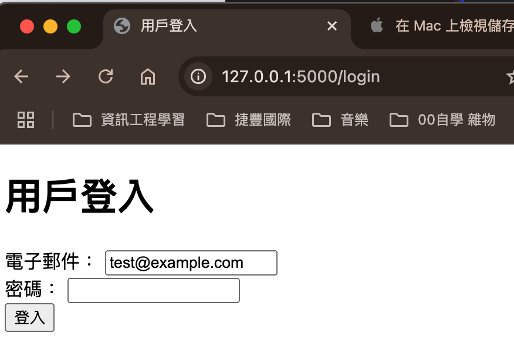
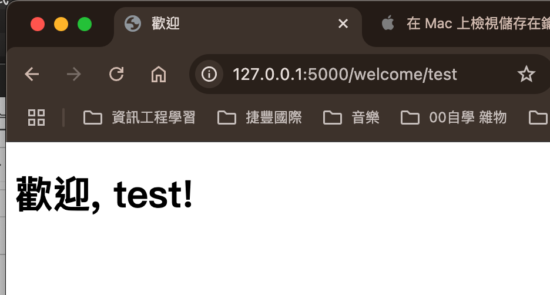

# Flask Login Project
Flask 框架簡單建立網頁 並使用自動化測試

## 查看視頻
本專案 使用chorme selenium 自動測試 網頁登入 影片：

[點擊此處下載視頻 autoTest.mp4 ](autoTest.mp4)
## 查看視頻
<video width="640" height="360" controls>
    <source src="autoTest.mp4" type="video/mp4">
    您的瀏覽器不支持視頻播放。
</video>

## 專案介紹
本專案是一個使用 Flask 框架建立的簡單登入功能網頁，包含以下主要功能：
- 使用者登入頁面
- 成功登入後的歡迎頁面

此專案適合作為 Flask 入門學習範例，並可擴展為更複雜的應用。

---

## 專案結構


---

## 檔案說明

### 1. `login.html`
- **用途**：顯示使用者登入頁面。
- **內容**：
  - 使用者名稱輸入框:
  - 密碼輸入框:
  - 登入按鈕
- **特色**：可進一步整合驗證邏輯與前端樣式。

目前設定的使用者名稱：test@example.com
目前設定的密碼：123

### 2. `welcome.html`
- **用途**：顯示登入成功後的歡迎訊息。
- **內容**：
  - 簡單的文字歡迎訊息
  - 可擴展為顯示個人化資訊。

### 3. `app.py`
- **用途**：專案的後端主程式。
- **內容**：
  - Flask 路由設定
  - 登入表單驗證邏輯
  - 登入成功或失敗的頁面跳轉。

---

## 如何執行專案

### 1. 安裝依賴
確保您已安裝 Python 和 `pip`，然後執行以下命令安裝 Flask：
```bash pip install flask```
### 2.啟動伺服器
在專案目錄中執行以下命令啟動Flask伺服器
python app.py
### 3.瀏覽網頁
在瀏覽器中打開以下網址訪問專案：
```http://127.0.0.1:5000```

## 專案功能展示
## 登入頁面：


使用者可在此輸入帳號與密碼進行登入。

## 歡迎頁面：


登入成功後顯示歡迎訊息。

### 未來改進方向
新增使用者註冊功能
整合資料庫（如 SQLite 或 MySQL）存儲使用者資料
增加前端樣式，提升用戶體驗

貢獻者
作者：kolyfish
聯繫方式：kolyfish2@gmail.com
