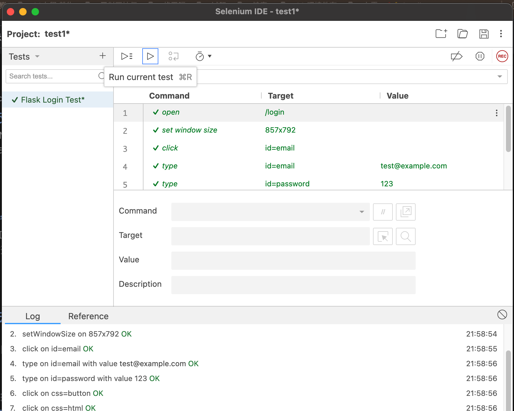

# Flask Login Project
Flask 框架簡單建立網頁 並使用自動化測試

## 查看視頻
本專案 使用chorme selenium 自動測試 網頁登入 請點擊此圖片播放影片：

[](https://www.youtube.com/watch?v=dO125m_-sKs)
- 影片中  執行測試 點擊 ```Run current test```

## 專案介紹
本專案是一個使用 Flask 框架建立的簡單登入功能網頁，包含以下主要功能：
- 使用者登入頁面
- 成功登入後的歡迎頁面


---

## 專案結構
flask_login_project/
├── templates/
│   ├── login.html        # 登入頁面 HTML 模板
│   ├── welcome.html      # 成功登入後的歡迎頁面 HTML 模板
├── app.py                # 主程式，處理 Flask 後端邏輯
├── .DS_Store             # macOS 系統自動生成的文件（可忽略）


---

## 檔案說明

### 1. `login.html`
- **用途**：顯示使用者登入頁面。
- **內容**：
  - 使用者名稱輸入框:
  - 密碼輸入框:
  - 登入按鈕
- **特色**：可進一步整合驗證邏輯與前端樣式。

目前設定的使用者名稱：test@example.com
目前設定的密碼：123

### 2. `welcome.html`
- **用途**：顯示登入成功後的歡迎訊息。
- **內容**：
  - 簡單的文字歡迎訊息
  - 可擴展為顯示個人化資訊。

### 3. `app.py`
- **用途**：專案的後端主程式。
- **內容**：
  - Flask 路由設定
  - 登入表單驗證邏輯
  - 登入成功或失敗的頁面跳轉。
    
### ４. `test_flaskLoginTest.py`
- **用途**：Selenium 導出的測試腳本。
- **內容**：
  - 每一個自動測試動作的描述
---

## 如何執行專案

### 1. 安裝依賴
確保您已安裝 Python 和 `pip`，然後執行以下命令安裝 Flask：
``` pip install flask```
### 2.啟動伺服器
用終端機在專案目錄中執行以下命令啟動Flask伺服器
```python app.py```
### 3.瀏覽網頁
在瀏覽器中打開以下網址訪問專案：
```http://127.0.0.1:5000/login```

## 專案功能展示
## 登入頁面：


使用者可在此輸入帳號與密碼進行登入。

## 歡迎頁面：


登入成功後顯示歡迎訊息。
### Selenium IDE 測試
#### 步驟 1：啟動 Selenium IDE
點擊瀏覽器工具列中的 Selenium IDE 圖示。
選擇 Create a New Project。
命名專案，例如 Flask Login Test。
#### 步驟 2：開始錄製測試
點擊 Record a New Test in Project。
輸入伺服器的 URL，例如：
arduino

```http://127.0.0.1:5000/login```
按 Start Recording，瀏覽器會自動打開登入頁面。
#### 步驟 3：操作步驟
在錄製模式下執行以下操作：

在 電子郵件欄位 輸入：test@example.com。
在 密碼欄位 輸入：123。
點擊 登入按鈕。
#### 結果驗證：

確認跳轉到歡迎頁面，並包含文字 歡迎, testuser!。
#### 步驟 4：停止錄製
完成操作後，回到 Selenium IDE。
點擊 Stop Recording。
將錄製的測試保存，命名為 Login Test。
#### 步驟 5：執行測試
在 Selenium IDE 主介面中，選中剛剛錄製的測試。
點擊 Run current test 按鈕。
確認測試能正常運行，並顯示測試結果。

貢獻者
作者：kolyfish
聯繫方式：kolyfish2@gmail.com
